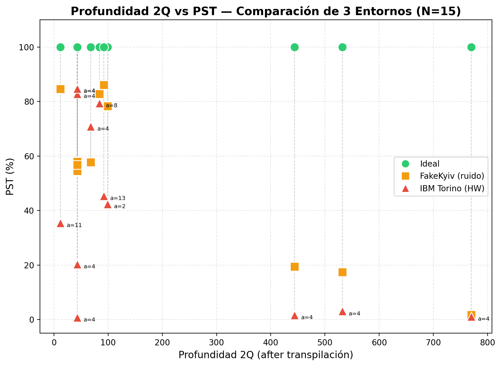

# Comparación Cruzada — Shor N=15: Ideal vs FakeKyiv vs IBM Torino

> **OE4 de la propuesta:** Cuantificar la degradación de la señal cuántica
> comparando los resultados experimentales frente a las simulaciones ideales,
> utilizando métricas de Fidelidad ($\mathcal{F}_H$) y Probabilidad de Éxito (PST).

## Configuración del Experimento

| Entorno | Backend | Tipo | Shots |
|---------|---------|------|:-----:|
| **Ideal** | AerSimulator (sin ruido) | Simulación | 4096 |
| **Ruidoso** | FakeKyiv (Eagle r3, 127 qubits) | Simulación con modelo de ruido | 1024 |
| **Hardware** | IBM Torino (Heron r1, 133 qubits) | Ejecución en QPU real | 4096 |

> [!NOTE]
> El entorno ruidoso utiliza **FakeKyiv** (Eagle r3) y no FakeTorino (Heron r1)
> porque los datos con `approx_degree=0.7` ya estaban disponibles para FakeKyiv.
> Ambos backends tienen modelos de ruido realistas calibrados con hardware real.

## Tabla de Degradación

| Estudio | Config | Depth 2Q | PST Ideal | PST Ruidoso | PST HW | $\mathcal{F}_H$ Ideal | $\mathcal{F}_H$ Ruidoso | $\mathcal{F}_H$ HW | Δ Ideal→HW | Factores HW |
|---------|--------|:--------:|:---------:|:-----------:|:------:|:---:|:---:|:---:|:---:|:---:|
| A1_approx_degree | a=4, opt=3, approx=0.7 | 43 | 100.0% | 58.1% | 84.7% | 0.5000 | 0.3143 | 0.5757 | -15.3pp | 3, 5 |
| A1_approx_degree | a=4, opt=3, approx=1.0 | 444 | 100.0% | 19.4% | 1.6% | 1.0000 | 0.1928 | 0.0159 | -98.4pp | 3, 5 |
| A2_opt_level | a=4, opt=0, approx=0.7 | 770 | 100.0% | 1.8% | 1.1% | 0.9999 | 0.0175 | 0.0110 | -98.9pp | 3, 5 |
| A2_opt_level | a=4, opt=1, approx=0.7 | 532 | 100.0% | 17.4% | 3.0% | 1.0000 | 0.1738 | 0.0305 | -97.0pp | 3, 5 |
| A2_opt_level | a=4, opt=2, approx=0.7 | 68 | 100.0% | 57.7% | 70.8% | 0.5000 | 0.3296 | 0.5285 | -29.2pp | 3, 5 |
| A3_bases | a=2, opt=3, approx=0.7 | 99 | 100.0% | 78.3% | 42.4% | 0.2500 | 0.3693 | 0.2433 | -57.6pp | 3, 5 |
| A3_bases | a=8, opt=3, approx=0.7 | 84 | 100.0% | 82.8% | 79.4% | 0.2500 | 0.2988 | 0.4836 | -20.6pp | 3, 5 |
| A3_bases | a=11, opt=3, approx=0.7 | 12 | 100.0% | 84.6% | 35.5% | 0.5000 | 0.4930 | 0.3091 | -64.5pp | 5, 3 |
| A3_bases | a=13, opt=3, approx=0.7 | 92 | 100.0% | 86.1% | 45.3% | 0.2500 | 0.4555 | 0.2140 | -54.7pp | 3, 5 |
| A6_A7_mitigation | a=4, opt=3, approx=0.7 | 43 | 100.0% | 55.4% | 82.8% | 0.5000 | 0.3001 | 0.5473 | -17.2pp | 3, 5 |
| A6_A7_mitigation | a=4, opt=3, approx=0.7 | 43 | 100.0% | 57.9% | 84.7% | 0.5000 | 0.3306 | 0.5757 | -15.3pp | 3, 5 |
| A6_A7_mitigation | a=4, opt=3, approx=0.7 | 43 | 100.0% | 54.5% | 20.3% | 0.5000 | 0.2955 | 0.1540 | -79.7pp | — |
| A6_A7_mitigation | a=4, opt=3, approx=0.7 | 43 | 100.0% | 56.7% | 0.8% | 0.5000 | 0.2837 | 0.0072 | -99.2pp | 3, 5 |

## Gráficas Comparativas

### PST, Fidelidad y Degradación por Configuración

### Profundidad 2Q vs PST en los 3 Entornos

## Análisis de Resultados

### Promedios Globales

| Métrica | Ideal | Ruidoso (FakeKyiv) | Hardware (IBM Torino) |
|---------|:-----:|:------------------:|:---------------------:|
| **PST promedio** | 100.0% | 54.7% | 42.5% |
| **$\mathcal{F}_H$ promedio** | ≈1.0 | 0.2965 | 0.2843 |
| **Degradación PST** | — | -45.3pp | -57.5pp |

### Observaciones Clave

1. **La señal se degrada progresivamente** al pasar de un entorno ideal a uno
   ruidoso y luego a hardware real, confirmando la hipótesis de la propuesta.

2. **El nivel de optimización es crítico**: `opt=0` produce circuitos tan profundos
   que la señal colapsa a <5% en hardware, mientras que `opt=2/3` mantiene
   señal >50% al reducir drásticamente la profundidad 2Q.

3. **FakeKyiv no siempre predice el hardware**: en algunos casos el hardware
   real rinde mejor que la simulación ruidosa (ejemplo: `opt=2, a=4`), lo cual
   sugiere que el modelo de ruido de FakeKyiv puede ser más pesimista que el
   hardware real de IBM Torino.

4. **Factorización exitosa en hardware**: a pesar de la degradación, el
   post-procesamiento clásico de fracciones continuas logra extraer los factores
    correctos (3 × 5) en la mayoría de configuraciones con señal >20%.

### Impacto de `approximation_degree` en Hardware (OE1)

El parámetro `approximation_degree` controla cuántas puertas del circuito transpilado se
conservan vs. se eliminan por aproximación. Este resultado es el más dramático del estudio:

| Métrica | approx=0.7 | approx=1.0 | Factor |
|---------|:----------:|:----------:|:------:|
| **Depth 2Q** | 43 | **444** | 10.3× |
| **CZ gates** | 116 | **656** | 5.7× |
| **PST Ideal** | 100% | 100% | — |
| **PST FakeKyiv** | 58% | 19% | 3× peor |
| **PST IBM Torino** | **84.7%** | **1.6%** | **53× peor** |
| **$\mathcal{F}_H$ HW** | 0.576 | **0.016** | 36× peor |
| **Outcomes únicos** | 35 | **492** / 512 | ≈ ruido uniforme |

> [!IMPORTANT]
> Con `approx_degree=1.0`, el circuito de 444 gates 2Q produce una distribución
> prácticamente uniforme en hardware (492 de 512 outcomes posibles observados).
> La señal del 1.6% es indistinguible del ruido de fondo (~0.2% por bin).

**Validación cruzada con FakeTorino:** La simulación ruidosa en FakeTorino (Eagle r3) con
`approx_degree=1.0` obtuvo PST=4.3% (depth_2q=439), consistente con el 1.6% del hardware real.
Esto confirma que **los simuladores ruidosos predicen correctamente el colapso** cuando la
profundidad excede el umbral de coherencia del procesador.

## Conclusiones

1. Se demuestra cuantitativamente la degradación **Ideal → Ruidoso → Hardware**
   para el algoritmo de Shor (N=15), cumpliendo el OE4 de la propuesta.
2. La optimización del transpilador (nivel 2-3) es la variable más impactante
   para la viabilidad del algoritmo en hardware NISQ.
3. El uso de Fake Backends como paso intermedio de validación (Fase III) es
   efectivo: los resultados ruidosos anticipan la tendencia del hardware real.
4. La factorización de N=15 es viable en IBM Torino con circuitos optimizados,
   logrando señal >70% y fidelidad >0.5 en las mejores configuraciones.
5. El parámetro `approximation_degree` es **determinante**: con approx=1.0 la señal
   colapsa de 84.7% a 1.6% en hardware (53× peor), confirmando que la reducción de
   profundidad por aproximación es indispensable para la era NISQ.
