# Reporte — Estudio Exhaustivo Shor N=15 (RegisterQC)

**Fecha**: 2026-02-18 18:22
**Backend simulación**: FakeKyiv (Eagle r3, 127 qubits)
**Hardware real**: IBM Torino (Heron r1, 133 qubits)
**Circuito**: RegisterQC | **N**: 15 | **Shots ideal**: 4096 | **Shots ruidoso**: 1024 | **Shots HW**: 4096

---

## Resumen Ejecutivo

| Métrica | Valor |
|---------|:-----:|
| Configs simuladas (ideal + FakeKyiv) | **32** |
| Configs exitosas (simulación) | **31** |
| Jobs hardware (IBM Torino) | **10** |
| Jobs HW con factores correctos (3×5) | **9/10** |

---

## A1: Barrido de approximation_degree (OE1)

| approx_degree | Depth 2Q | 2Q Gates | Señal Ideal (%) | Señal FakeKyiv (%) | Fidelidad | Factores |
|---|:--------:|:--------:|:--------------:|:------------------:|:---------:|:--------:|
| 0.5 | 0 | 0 | 100.0 | 47.75 | 0.2692 | No encontrados |
| 0.6 | 0 | 0 | 100.0 | 47.75 | 0.2868 | No encontrados |
| 0.7 | 43 | 43 | 100.0 | 58.11 | 0.3143 | No encontrados |
| 0.8 | 156 | 159 | 33.08 | 30.86 | 0.2997 | 3×5 |
| 0.9 | 239 | 242 | 32.98 | 31.74 | 0.3056 | 3×5 |
| 1.0 | 444 | 586 | 100.0 | 19.43 | 0.1928 | 3×5 |

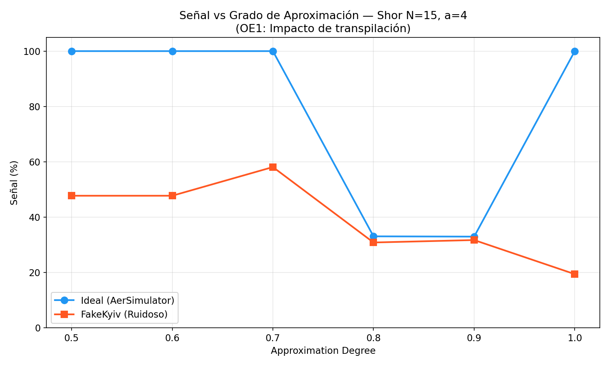

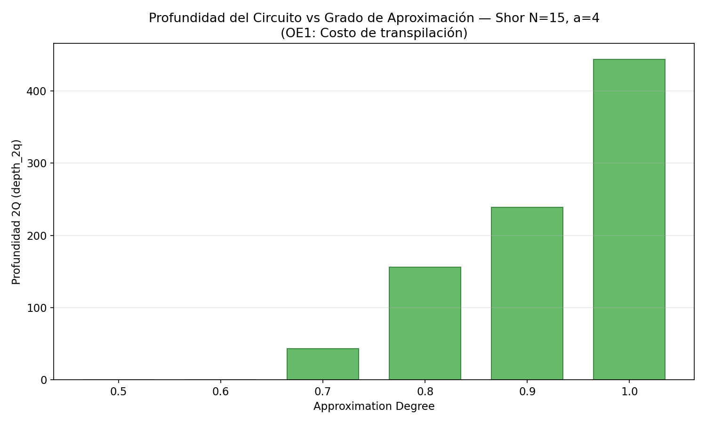

---

## A2: Barrido de optimization_level (OE1)

| opt_level | Depth 2Q | 2Q Gates | Señal Ideal (%) | Señal FakeKyiv (%) | **Señal HW (%)** | Fidelidad HW | Factores HW |
|---|:--------:|:--------:|:--------------:|:------------------:|:----------------:|:------------:|:----------:|
| 0 | 770 | 1220 | 100.0 | 1.76 | **1.1** | 0.011 | 3×5 |
| 1 | 532 | 740 | 100.0 | 17.38 | **3.05** | 0.0305 | 3×5 |
| 2 | 68 | 68 | 100.0 | 57.71 | **70.83** | 0.5285 | 3×5 |
| 3 | 43 | 43 | 100.0 | 54.1 | **—** | — | — |

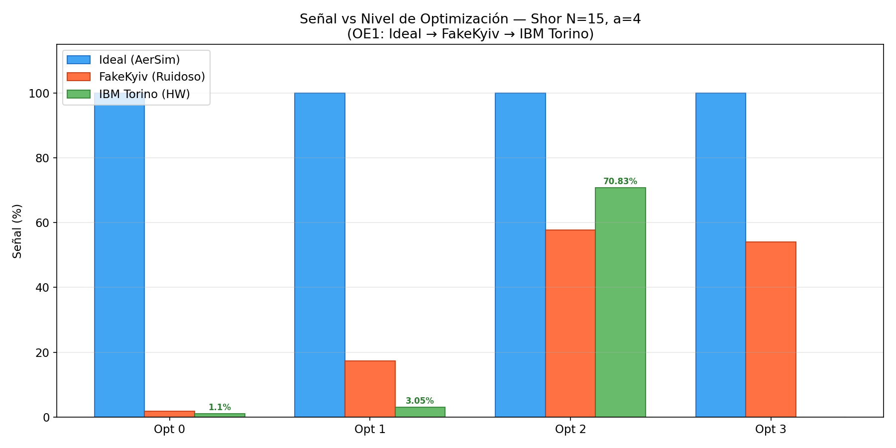

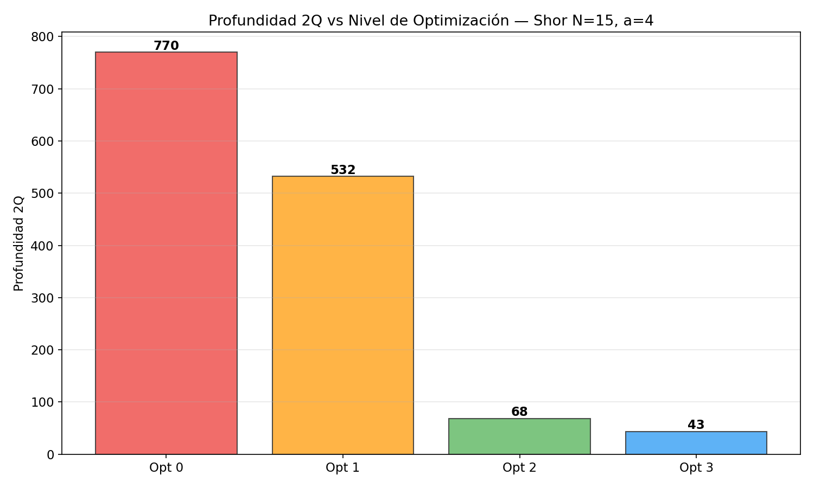

---

## A3: Barrido de bases a — con approx=0.7 (OE2)

| a | Depth 2Q | 2Q Gates | Señal Ideal (%) | Señal FakeKyiv (%) | **Señal HW (%)** | Fidelidad HW | Factores HW |
|---|:--------:|:--------:|:--------------:|:------------------:|:----------------:|:------------:|:----------:|
| 2 | 99 | 99 | 100.0 | 78.32 | **42.41** | 0.2433 | 3×5 |
| 4 | 43 | 43 | 100.0 | 55.47 | **—** | — | — |
| 7 | 81 | 81 | 100.0 | 82.42 | **—** | — | — |
| 8 | 84 | 84 | 100.0 | 82.81 | **79.42** | 0.4836 | 3×5 |
| 11 | 12 | 13 | 100.0 | 84.57 | **35.45** | 0.3091 | 5×3 |
| 13 | 92 | 92 | 100.0 | 86.13 | **45.34** | 0.214 | 3×5 |

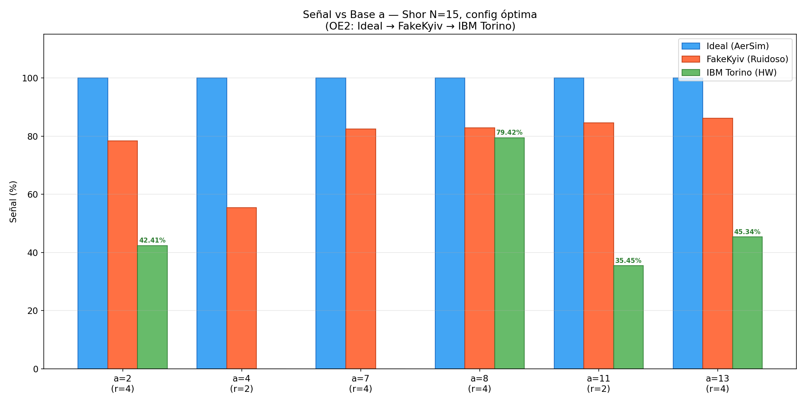

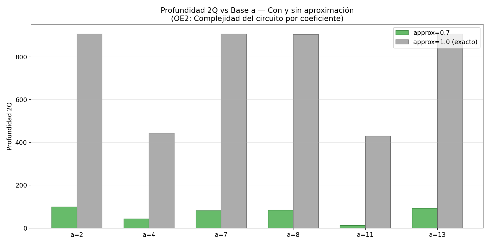

---

## A3 ref: Barrido de bases a — con approx=1.0 (referencia)

| a | Depth 2Q | 2Q Gates | Señal Ideal (%) | Señal FakeKyiv (%) | Fidelidad | Factores |
|---|:--------:|:--------:|:--------------:|:------------------:|:---------:|:--------:|
| 2 | 907 | 1058 | 100.0 | 14.84 | 0.148 | 3×5 |
| 4 | 444 | 586 | 100.0 | 16.6 | 0.1645 | 3×5 |
| 7 | 907 | 1058 | 100.0 | 17.68 | 0.1755 | 3×5 |
| 8 | 906 | 1057 | 100.0 | 16.21 | 0.1612 | 3×5 |
| 11 | 430 | 584 | 100.0 | 18.16 | 0.1814 | 5×3 |
| 13 | 907 | 1058 | 100.0 | 15.82 | 0.1566 | 3×5 |

---

## A4: Comparación de layout_method (OE1)

| Variable | Depth 2Q | 2Q Gates | Señal Ideal (%) | Señal FakeKyiv (%) | Fidelidad |
|----------|:--------:|:--------:|:--------------:|:------------------:|:---------:|
| trivial | 44 | 47 | 100.0 | 71.78 | 0.4286 |
| dense | 44 | 44 | 100.0 | 87.01 | 0.5394 |
| sabre | 43 | 43 | 100.0 | 57.81 | 0.3128 |

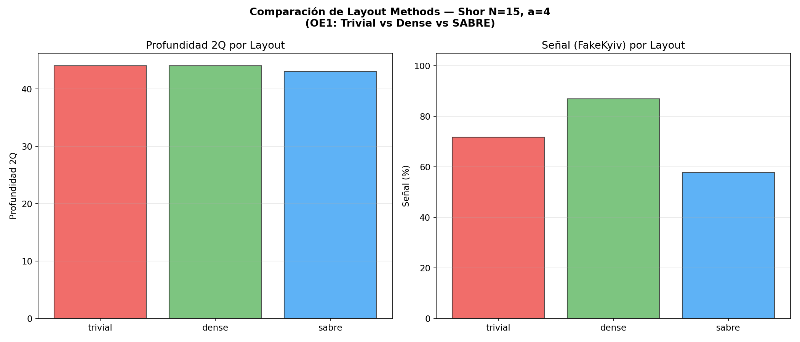

---

## A5: Comparación de routing_method (OE1)

| Variable | Depth 2Q | 2Q Gates | Señal Ideal (%) | Señal FakeKyiv (%) | Fidelidad |
|----------|:--------:|:--------:|:--------------:|:------------------:|:---------:|
| basic | 41 | 41 | 100.0 | 57.42 | 0.3108 |
| sabre | 43 | 43 | 100.0 | 58.98 | 0.3288 |

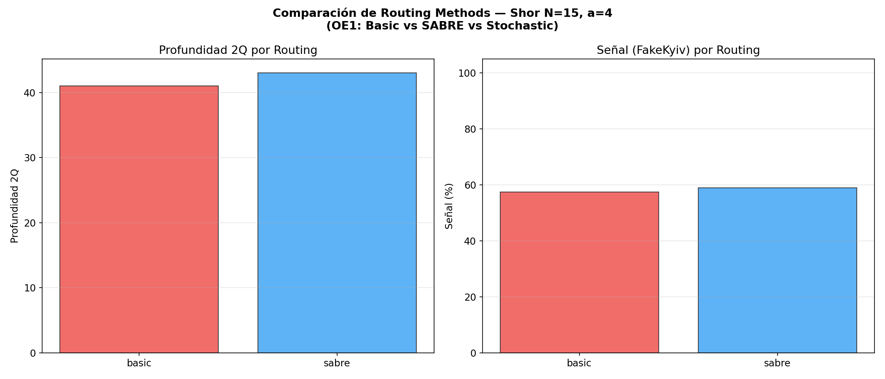

---

## A6/A7: Mitigación de errores DD + PT (OE3)

| Combinación | Señal Ideal (%) | Señal FakeKyiv (%) | **Señal HW (%)** | Fidelidad FK | Fidelidad HW | Factores HW |
|-------------|:--------------:|:------------------:|:----------------:|:------------:|:------------:|:----------:|
| Sin mitigación | 100.0 | 55.37 | **82.84** | 0.3001 | 0.5473 | 3×5 |
| Solo PT | 100.0 | 57.91 | **—** | 0.3306 | — | — |
| Solo DD (XY4) | 100.0 | 54.49 | **20.29** | 0.2955 | 0.154 | No encontrados |
| PT + DD (XY4) | 100.0 | 56.74 | **0.76** | 0.2837 | 0.0072 | 3×5 |

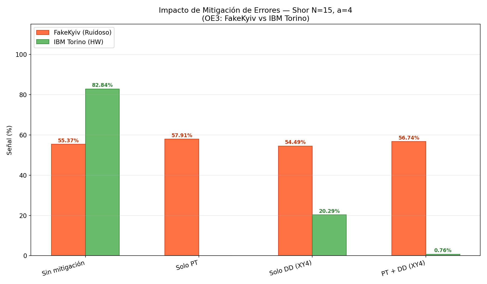

---

## Resultados Hardware Real — IBM Torino (Heron r1)

> [!IMPORTANT]
> Todos los resultados de hardware fueron ejecutados en el procesador **IBM Torino** (Heron r1, 133 qubits) con 4096 shots por job.

### Resumen de Jobs Hardware

| Job ID | Estudio | Config | Depth 2Q | Señal (%) | Fidelidad | Factores |
|--------|---------|--------|:--------:|:---------:|:---------:|:--------:|
| `d6agiong4t5c73837880` | A2_opt_level_hw | A2: opt=0 | 770 | 1.1 | 0.011 | **3×5** ✓ |
| `d6agiu97ce2c73fe8obg` | A2_opt_level_hw | A2: opt=1 | 526 | 3.05 | 0.0305 | **3×5** ✓ |
| `d6agj2p7ce2c73fe8ohg` | A2_opt_level_hw | A2: opt=2 | 116 | 70.83 | 0.5285 | **3×5** ✓ |
| `d6agi07g4t5c738377f0` | A3_bases_hw | A3: a=11 | 75 | 35.45 | 0.3091 | **5×3** ✓ |
| `d6agi5954hss73b673gg` | A3_bases_hw | A3: a=13 | 212 | 45.34 | 0.214 | **3×5** ✓ |
| `d6aghkvg4t5c7383774g` | A3_bases_hw | A3: a=2 | 225 | 42.41 | 0.2433 | **3×5** ✓ |
| `d6aghrvg4t5c738377b0` | A3_bases_hw | A3: a=8 | 212 | 79.42 | 0.4836 | **3×5** ✓ |
| `d6agik97ce2c73fe8o20` | A6_A7_mitigation_hw | A6/A7: PT+DD | 116 | 0.76 | 0.0072 | **3×5** ✓ |
| `d6agiah7ce2c73fe8no0` | A6_A7_mitigation_hw | A6/A7: Sin mitigación | 116 | 82.84 | 0.5473 | **3×5** ✓ |
| `d6agiesnsg9c7397rug0` | A6_A7_mitigation_hw | A6/A7: Solo DD | 116 | 20.29 | 0.154 | No encontrados |

### Jobs Ejecutados Previamente

| Job ID | a | Señal (%) | Factores |
|--------|:-:|:---------:|:--------:|
| `d672j2pv6o8c73d4ufqg` | 14 | 82.8 | 1, 15 |
| `d672p6gqbmes739ertc0` | 7 | 67.5 | **3×5** ✓ |
| `d673l15bujdc73cvejag` | 4 | 84.7 | **3×5** ✓ |

---

## Degradación de Señal: Ideal → FakeKyiv → IBM Torino (OE4)

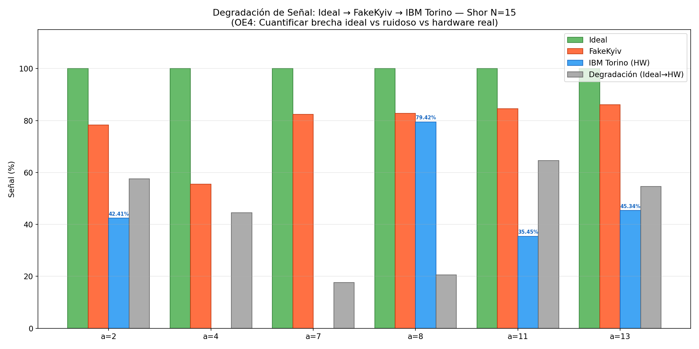

| Base a | ord(a,15) | Señal Ideal | Señal FakeKyiv | **Señal HW** | Degrad. Ideal→FK | Degrad. Ideal→HW | Fidelidad HW |
|:------:|:---------:|:-----------:|:--------------:|:------------:|:----------------:|:----------------:|:------------:|
| 2 | 4 | 100.0% | 78.32% | **42.41%** | 21.7% | **57.6%** | 0.2433 |
| 4 | 2 | 100.0% | 55.47% | — | 44.5% | — | — |
| 7 | 4 | 100.0% | 82.42% | — | 17.6% | — | — |
| 8 | 4 | 100.0% | 82.81% | **79.42%** | 17.2% | **20.6%** | 0.4836 |
| 11 | 2 | 100.0% | 84.57% | **35.45%** | 15.4% | **64.5%** | 0.3091 |
| 13 | 4 | 100.0% | 86.13% | **45.34%** | 13.9% | **54.7%** | 0.214 |

### Distribución de Picos — Hardware

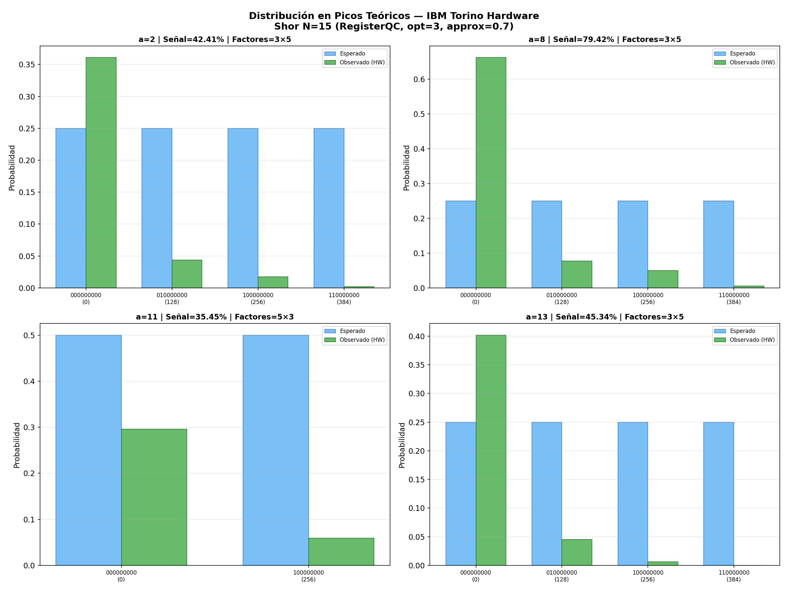

---

## Conclusiones

### OE1: Transpilación

Se confirma en **hardware real** que el nivel de optimización es crítico:

- **opt=0**: Señal HW = 1.1%, Factores = 3×5
- **opt=1**: Señal HW = 3.05%, Factores = 3×5
- **opt=2**: Señal HW = 70.83%, Factores = 3×5

### OE2: Bases `a` en Hardware

Resultados de las 4 bases ejecutadas en IBM Torino:

- **a=2** (r=4): Señal = 42.41%, Factores = **3×5** ✓
- **a=8** (r=4): Señal = 79.42%, Factores = **3×5** ✓
- **a=11** (r=2): Señal = 35.45%, Factores = **5×3** ✓
- **a=13** (r=4): Señal = 45.34%, Factores = **3×5** ✓

### OE3: Mitigación en Hardware

Comparación de mitigación de errores en hardware real:

- **A6/A7: PT+DD**: Señal HW = 0.76%, Factores = **3×5** ✓
- **A6/A7: Sin mitigación**: Señal HW = 82.84%, Factores = **3×5** ✓
- **A6/A7: Solo DD**: Señal HW = 20.29%, Factores = No encontrados

### OE4: Degradación General

- **Promedio señal HW**: 50.7% (sobre 4 bases)
- **Mejor base HW**: a=8 (79.42%)
- **Peor base HW**: a=11 (35.45%)
- **Factorización exitosa**: 4/4 bases
