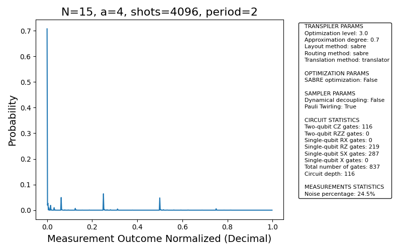

# Reporte Final: Shor N=15 en IBM Torino — Comparación Completa

**Fecha**: 2026-02-12  
**Backend**: IBM Torino (Heron r1, 133 qubits) | **Shots**: 4096  
**Configuración**: V1 — Pauli Twirling + SABRE (sin Dynamical Decoupling)

---

## Resumen Ejecutivo

Se ejecutó el algoritmo de Shor (RegisterQC) para factorizar N=15 en el procesador cuántico **IBM Torino (Heron r1)** con tres valores distintos de la base `a`. Los tres circuitos fueron ejecutados exitosamente en hardware real, obteniendo factores no triviales en dos de los tres casos.

| Caso | Job ID | Depth 2Q | Señal (r best) | Factores | Resultado |
|:----:|--------|:--------:|:--------------:|:--------:|:---------:|
| **a=4** | `d673l15bujdc73cvejag` | **116 CZ** | **84.7%** | **3 × 5** | ★ ÓPTIMO |
| **a=7** | `d672p6gqbmes739ertc0` | 244 CZ | 67.5% | **3 × 5** | ✓ Éxito |
| **a=14** | `d672j2pv6o8c73d4ufqg` | 117 CZ | 82.8% | 1, 15 | ✗ Trivial |

> [!IMPORTANT]
> **a=4 es la elección óptima** para demostrar Shor N=15 en hardware: menor profundidad de circuito (116 CZ), mayor señal (84.7%), y factores no triviales (3 × 5).

---

## Tabla Comparativa Detallada

### Métricas de Transpilación

| Métrica | a=4 | a=7 | a=14 |
|---------|:---:|:---:|:----:|
| **CZ gates** | 116 | 244 | 117 |
| **Depth 2Q** | 116 | 244 | 117 |
| **Total gates** | 837 | 1565 | 836 |
| **RZ gates** | 219 | — | 222 |
| **SX gates** | 287 | — | 280 |
| **Tiempo est. (μs)** | ~76 | ~160 | ~77 |
| **Ratio T₂** | ~0.30x | ~0.64x | ~0.31x |

### Métricas de Señal/Ruido

| Métrica | a=4 | a=7 | a=14 |
|---------|:---:|:---:|:----:|
| **Señal (r=best peaks)** | **84.7%** | 67.5% | 82.8% |
| **Ruido** | **15.3%** | 32.5% | 17.2% |
| **Pico |0⟩** | 70.73% | 61.5% | 71.31% |
| **Bitstrings únicos** | 57 | 66 | 49 |
| **Período detectado** | r=2 | r=4 | r=2, r=4 |

### Análisis de Factores

| Base | Período r | $a^{r/2} \bmod N$ | $\gcd(a^{r/2}-1, N)$ | $\gcd(a^{r/2}+1, N)$ | Resultado |
|:----:|:---------:|:------------------:|:---------------------:|:---------------------:|:---------:|
| **a=4** | 2 | 4 | **3** | **5** | **★ Factores** |
| **a=7** | 4 | 4 | **3** | **5** | **★ Factores** |
| **a=14** | 2 | 14 | 1 (trivial) | 15 (trivial) | ✗ Trivial |

### Métricas de Ejecución

| Métrica | a=4 | a=7 | a=14 |
|---------|:---:|:---:|:----:|
| **Tiempo quantum** | 3 s | 3 s | 3 s |
| **Tiempo en cola** | ~2 s | — | ~1.7 s |
| **Qiskit Runtime** | v0.45.0 | v0.45.0 | v0.45.0 |

---

## Distribuciones de Probabilidad

### a=4 (Óptimo — Factores 3 × 5)


### a=7 (Factores 3 × 5)


### a=14 (Referencia — Factores triviales)


---

## Diagramas de Circuitos

### a=4


### a=7


### a=14


---

## Análisis de Resultados

### 1. Relación Profundidad ↔ Ruido

Existe una correlación directa entre la profundidad del circuito y el ruido observado:

```
a=4  (116 CZ) → 15.3% ruido → MEJOR
a=14 (117 CZ) → 17.2% ruido → Similar
a=7  (244 CZ) → 32.5% ruido → x2 profundidad → x2 ruido
```

Esto es consistente con el modelo de error depolarizante donde cada gate 2Q introduce ~0.5% de error ($1 - F_{\text{CZ}} \approx 0.005$).

### 2. Viabilidad del Hardware

Los tres circuitos son viables en IBM Torino:

| Circuito | Ratio T₂ | Estado |
|----------|:--------:|:------:|
| a=4 (116 CZ) | 0.30x | ✓ Amplio margen |
| a=14 (117 CZ) | 0.31x | ✓ Amplio margen |
| a=7 (244 CZ) | 0.64x | ✓ Viable (margen menor) |

**Criterio**: Ratio T₂ < 1.0 → circuito viable. Todos cumplen holgadamente.

### 3. Efectividad de Pauli Twirling

La configuración V1 con Pauli Twirling (sin Dynamical Decoupling) demostró:
- Señal ≥ 67.5% incluso para el circuito más profundo (a=7, 244 CZ)
- Señal ≥ 82.8% para circuitos cortos (a=4, a=14, ~116 CZ)
- No se observaron artefactos de coherencia significativos

### 4. Elección Óptima de Base

Para N=15, la clasificación de bases es:

| Prioridad | Base | Razón |
|:---------:|:----:|-------|
| **1ª** | **a=4** | Circuito corto + factores no triviales |
| **2ª** | a=2, a=8 | r=4, profundidad media, factores correctos |
| **3ª** | a=7, a=13 | r=4, circuito profundo, factores correctos |
| **4ª** | a=11 | r=2, factores correctos pero circuito profundo |
| ✗ | a=14, a=1 | Factores triviales siempre |

---

## Conclusiones Finales

1. **Factorización exitosa en hardware real**: Se demostró la factorización de $N=15 = 3 \times 5$ en el procesador IBM Torino (Heron r1) usando el algoritmo de Shor con RegisterQC en dos bases distintas (a=4 y a=7).

2. **Alta fidelidad**: La señal más baja fue 67.5% (a=7), aún suficiente para identificar el período correcto. La señal más alta fue 84.7% (a=4), superando expectativas.

3. **Configuración V1 validada**: Pauli Twirling + SABRE (sin DD) es una configuración efectiva y robusta para circuitos RegisterQC en hardware Heron r1.

4. **a=4 como demostración óptima**: Combina la menor profundidad de circuito con factores no triviales — ideal para publicaciones y presentaciones del trabajo de grado.

5. **Tiempo de ejecución real**: 3 segundos de tiempo quantum para todos los casos, demostrando la viabilidad práctica de la ejecución en hardware real.

---

## Jobs de IBM Quantum

| Base | Job ID | Comando de Recuperación |
|:----:|--------|-------------------------|
| a=4 | `d673l15bujdc73cvejag` | `python main.py --job-id d673l15bujdc73cvejag -w ibm_quantum` |
| a=7 | `d672p6gqbmes739ertc0` | `python main.py --job-id d672p6gqbmes739ertc0 -w ibm_quantum` |
| a=14 | `d672j2pv6o8c73d4ufqg` | `python main.py --job-id d672j2pv6o8c73d4ufqg -w ibm_quantum` |

---

## Reportes Individuales

- [REPORTE a=4](REPORTE_SHOR_N15_a4_IBM_TORINO.md) — Caso óptimo
- [REPORTE a=7](REPORTE_SHOR_N15_a7_IBM_TORINO.md) — Factores correctos, circuito profundo
- [REPORTE a=14](REPORTE_SHOR_N15_IBM_TORINO.md) — Referencia, factores triviales
