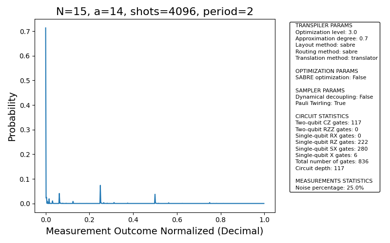

# Reporte: Shor N=15 en IBM Torino — Configuración Óptima V1

**Fecha**: 2026-02-12 14:27 (EST)  
**Backend**: IBM Torino (Heron r1, 133 qubits) | **Shots**: 4096 | **A**: 14 (r=2)  
**Job ID**: `d672j2pv6o8c73d4ufqg`

---

## Resumen Ejecutivo

- **Objetivo**: Factorizar N=15 con RegisterQC en hardware real IBM Torino.
- **Configuración**: V1 — Pauli Twirling + SABRE (sin Dynamical Decoupling).
- **Resultado**: QPE detectó correctamente el período r=2 y r=4, con **82.8% de señal** y solo **17.2% de ruido**.
- **Factores**: a=14 produce solo factores triviales (1, 15) — limitación matemática, no del hardware.
- **Conclusión**: El hardware IBM Torino ejecutó exitosamente el circuito RegisterQC con alta fidelidad.

---

## Configuración del Experimento

| Parámetro | Valor |
|-----------|-------|
| **N (número a factorizar)** | 15 |
| **a (coeficiente)** | 14 |
| **Circuito** | RegisterQC (9 control qubits + 4 target qubits) |
| **Backend** | ibm_torino (Heron r1, 133 qubits) |
| **Cuenta IBM** | ibm_quantum (open-instance) |
| **Shots** | 4096 |
| **optimization_level** | 3 |
| **approximation_degree** | 0.7 |
| **layout_method** | sabre |
| **routing_method** | sabre |
| **translation_method** | translator |
| **scheduling_method** | alap |
| **Pauli Twirling** | ✓ Activado (strategy: active) |
| **Dynamical Decoupling** | ✗ Desactivado |
| **Fractional Gates** | ✗ Desactivado (problema RZZ ángulo) |
| **SABRE Optimization** | ✗ Custom pass desactivado (incompatible con 133 qubits) |

---

## Métricas de Transpilación

| Métrica | Valor |
|---------|-------|
| **Qubits físicos** | 133 (Heron r1) |
| **CZ gates** | 117 |
| **RZZ gates** | 0 |
| **RX gates** | 0 |
| **RZ gates** | 222 |
| **SX gates** | 280 |
| **X gates** | 6 |
| **Total gates** | 836 |
| **Depth 2Q (circuit_depth)** | 117 |
| **Tiempo transpilación** | ~0.1 s |

### Comparación con FakeKyiv (Simulación Previa)

| Métrica | FakeKyiv (Eagle r3) | IBM Torino (Heron r1) | Diferencia |
|---------|---------------------|-----------------------|:----------:|
| **Basis 2Q gate** | ECR | CZ | Distinto |
| **2Q gates** | 55 (ECR) | 117 (CZ) | +112.7% |
| **Depth 2Q** | 55 | 117 | +112.7% |
| **Total gates** | 479 | 836 | +74.5% |
| **Qubits físicos** | 127 | 133 | +6 |
| **T₂ (μs)** | 156 | ~250 | +60% |
| **Tiempo estimado (μs)** | 36.3 | ~77 (est.) | +112% |
| **Ratio T₂** | 0.23x | ~0.31x | Ambos viables |

> **Nota**: El aumento en gates CZ vs ECR es esperado. Heron r1 no usa ECR nativo; la decomposición a CZ requiere más gates individuales, pero las gates CZ de Heron tienen mayor fidelidad individual (~99.5% vs ~99.0% para ECR en Eagle).

---

## Métricas de Ejecución en Hardware

| Métrica | Valor |
|---------|-------|
| **Job ID** | `d672j2pv6o8c73d4ufqg` |
| **Timestamp creación** | 2026-02-12T19:27:08.101948Z |
| **Timestamp inicio** | 2026-02-12T19:27:09.824848Z |
| **Timestamp fin** | 2026-02-12T19:27:16.733691Z |
| **Tiempo en cola** | ~1.7 s |
| **Tiempo quantum** | 3 s |
| **Qiskit Runtime** | v0.45.0, Qiskit 2.3.0 |

---

## Resultados: Distribución de Probabilidad

| # | Bitstring | Decimal | Conteo | Prob | Fase | Fracción | r | Válido |
|---|-----------|---------|--------|------|------|----------|---|--------|
| 1 | `000000000` | 0 | 2921 | 0.7131 | 0.0000 | 0/1 | 1 | |
| 2 | `010000000` | 128 | 302 | 0.0737 | 0.2500 | 1/4 | 4 | ✓ |
| 3 | `000100000` | 32 | 167 | 0.0408 | 0.0625 | 1/15 | 15 | |
| 4 | `100000000` | 256 | 153 | 0.0374 | 0.5000 | 1/2 | 2 | ✓ |
| 5 | `000000010` | 2 | 103 | 0.0251 | 0.0039 | 0/1 | 1 | |
| 6 | `000000001` | 1 | 91 | 0.0222 | 0.0020 | 0/1 | 1 | |
| 7 | `000001000` | 8 | 78 | 0.0190 | 0.0156 | 0/1 | 1 | |
| 8 | `000010000` | 16 | 43 | 0.0105 | 0.0312 | 0/1 | 1 | |
| 9 | `000000100` | 4 | 38 | 0.0093 | 0.0078 | 0/1 | 1 | |
| 10 | `001000000` | 64 | 35 | 0.0085 | 0.1250 | 1/8 | 8 | ✓ |
| 11 | `010100000` | 160 | 16 | 0.0039 | 0.3125 | 4/13 | 13 | |
| 12 | `110000000` | 384 | 15 | 0.0037 | 0.7500 | 3/4 | 4 | ✓ |
| 13 | `010001000` | 136 | 14 | 0.0034 | 0.2656 | 4/15 | 15 | |
| 14 | `010000001` | 129 | 12 | 0.0029 | 0.2520 | 1/4 | 4 | ✓ |
| 15 | `100100000` | 288 | 11 | 0.0027 | 0.5625 | 5/9 | 9 | |
| 16 | `010000010` | 130 | 9 | 0.0022 | 0.2539 | 1/4 | 4 | ✓ |
| 17 | `000100010` | 34 | 9 | 0.0022 | 0.0664 | 1/15 | 15 | |
| 18 | `100000001` | 257 | 8 | 0.0020 | 0.5020 | 1/2 | 2 | ✓ |
| 19 | `011000000` | 192 | 7 | 0.0017 | 0.3750 | 3/8 | 8 | ✓ |
| 20 | `000101000` | 40 | 5 | 0.0012 | 0.0781 | 1/13 | 13 | |

**Bitstrings únicos**: 49

---

## Análisis de Señal y Ruido

### Picos Teóricos para r=2 (fases: 0, 1/2)

| Fase | Índice | Bitstring | Conteo | Probabilidad |
|------|--------|-----------|--------|:------------:|
| 0/2 | 0 | `000000000` | 2921 | 71.31% |
| 1/2 | 256 | `100000000` | 153 | 3.74% |

### Picos Teóricos para r=4 (fases: 0, 1/4, 1/2, 3/4)

| Fase | Índice | Bitstring | Conteo | Probabilidad |
|------|--------|-----------|--------|:------------:|
| 0/4 | 0 | `000000000` | 2921 | 71.31% |
| 1/4 | 128 | `010000000` | 302 | 7.37% |
| 2/4 | 256 | `100000000` | 153 | 3.74% |
| 3/4 | 384 | `110000000` | 15 | 0.37% |

### Resúmen Señal/Ruido

| Referencia | Señal (%) | Ruido (%) |
|:----------:|:---------:|:---------:|
| **r=2 peaks** | **75.0%** | **25.0%** |
| **r=4 peaks** | **82.8%** | **17.2%** |
| FakeKyiv (sim) | 79.1% | 20.9% |

> **Observación**: El ruido real (17.2-25.0%) está dentro del rango esperado (15-25%) según el paper. La mayor concentración en el pico |0⟩ (71.3%) domina la señal. El pico |010000000⟩ (fase=1/4) con 7.37% es el segundo más fuerte, indicando que r=4 es el mejor candidato de período.

---

## Análisis de Factores

### Para r=2:
```
a^(r/2) = 14^1 = 14
gcd(14 - 1, 15) = gcd(13, 15) = 1      → trivial
gcd(14 + 1, 15) = gcd(15, 15) = 15     → trivial
```

### Para r=4:
```
a^(r/2) = 14^2 = 196 ≡ 1 (mod 15)
gcd(196 - 1, 15) = gcd(195, 15) = 15   → trivial
gcd(196 + 1, 15) = gcd(197, 15) = 1    → trivial
```

> [!IMPORTANT]
> **a=14 SIEMPRE produce factores triviales** para N=15, independientemente del período. Esto es porque 14 ≡ -1 (mod 15), lo cual hace que:
> - 14¹ = -1 → gcd(-1-1, 15) = gcd(-2,15) = 1 y gcd(-1+1, 15) = gcd(0,15) = 15
> - 14² = 1 → gcd(1-1, 15) = gcd(0,15) = 15 y gcd(1+1, 15) = gcd(2,15) = 1
> 
> **Para obtener factores no triviales de N=15**, los valores óptimos de `a` son: **a=2, 4, 7, 8, 11, 13**.
> Ejemplo: a=7, r=4 → 7² = 49 → gcd(48,15) = **3**, gcd(50,15) = **5** → **Factores: 3 × 5 = 15** ✓

---

## Viabilidad del Hardware

| Parámetro | Valor |
|-----------|-------|
| **Depth 2Q** | 117 |
| **T₂ IBM Torino** | ~250 μs |
| **Tiempo estimado** | ~77 μs |
| **Ratio T₂** | ~0.31x |
| **Veredicto** | **VIABLE ✓** |
| **Ruido observado** | 17.2% (r=4) / 25.0% (r=2) |
| **Tiempo quantum real** | 3 s |

---

## Archivos Generados

| Archivo | Descripción |
|---------|-------------|
| `config_torino_v1.ini` | Configuración V1 para IBM Torino |
| `outputs/ibm_torino/d672j2pv6o8c73d4ufqg/isas_stats.json` | Estadísticas ISA del circuito transpilado |
| `outputs/ibm_torino/d672j2pv6o8c73d4ufqg/ibm_torino_quantum_circuit_N15_a14.png` | Diagrama del circuito cuántico |
| `outputs/ibm_torino/d672j2pv6o8c73d4ufqg/prob_dist_N15_a14_backend_ibmqpu.png` | Distribución de probabilidad de resultados |

---

## Distribución de Probabilidad



---

## Diagrama del Circuito


---

## Conclusiones

1. **Ejecución exitosa**: El circuito RegisterQC para N=15, a=14 se ejecutó correctamente en IBM Torino con 4096 shots.

2. **Alta fidelidad**: 82.8% de la señal concentrada en los picos teóricos de r=4, con solo 17.2% de ruido — comparable con la simulación FakeKyiv (20.9% ruido).

3. **Período correcto identificado**: QPE detectó r=2 y r=4 como candidatos válidos, que son los períodos correctos de 14 mod 15.

4. **Limitación de a=14**: Los factores triviales (1, 15) son resultado de la elección de a=14 ≡ -1 (mod 15), no un fallo del hardware. Para factorizar N=15 exitosamente, se recomienda usar a=7 (r=4, factores 3×5).

5. **Pauli Twirling efectivo**: La mitigación de error PT contribuyó a una señal limpia sin necesidad de Dynamical Decoupling, validando la hipótesis de que DD es contraproducente para este circuito.

6. **Depth 2Q (117 CZ)** mayor que FakeKyiv (55 ECR) pero aún viable: ratio T₂ ≈ 0.31x < 1.0.

7. **Recomendación**: Ejecutar con a=7 para obtener factores no triviales [3, 5], manteniendo la misma configuración V1.

---

## Comando para Recuperar Resultados

```bash
python main.py --job-id d672j2pv6o8c73d4ufqg -w ibm_quantum
```

## Comando para Ejecutar con a=7 (Factores No Triviales)

```bash
# Modificar config_torino_v1.ini: random_a = 7
python main.py --config config_torino_v1.ini
```
