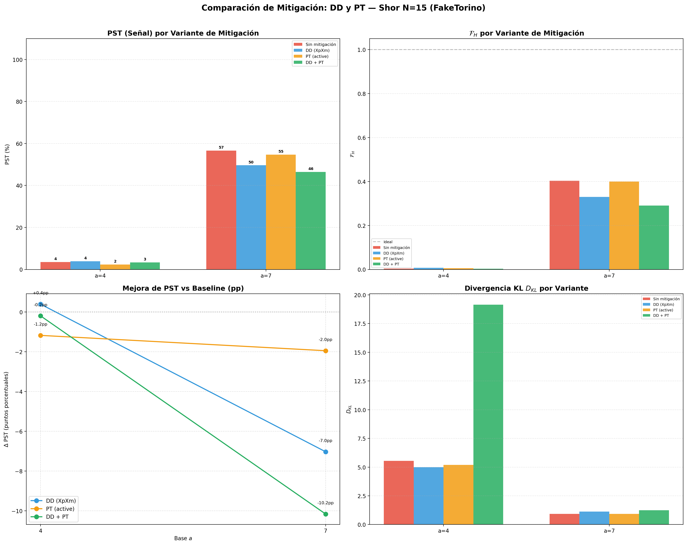

# Comparación de Mitigación de Errores: DD y PT — Shor N=15

> **Objetivo:** Evaluar el impacto de Dynamical Decoupling (DD) y Pauli Twirling (PT) en la señal y fidelidad del algoritmo de Shor ejecutado con ruido (FakeTorino).

## 1. Técnicas Evaluadas

| Técnica | Descripción |
|:---|:---|
| **DD (XpXm)** | Secuencia de pulsos X durante idle periods para suprimir decoherencia |
| **PT (active)** | Aleatorización de errores coherentes en gates 2Q + medición |

### Variantes

| # | Variante | DD | PT |
|:---:|:---|:---:|:---:|
| 1 | Baseline (sin mitigación) | ❌ | ❌ |
| 2 | DD only | ✅ XpXm | ❌ |
| 3 | PT only | ❌ | ✅ active |
| 4 | DD + PT | ✅ XpXm | ✅ active |

## 2. Configuración

- **Backend:** AerSimulator + FakeTorino (ruido activo)
- **Opt level:** 3
- **Shots:** 512
- **Layout/Routing:** SABRE / SABRE

## 3. Gráficas

## 4. Tabla de Resultados

| Base | Variante | PST (%) | $\mathcal{F}_H$ | Factores | Estado |
|:---:|:---|:---:|:---:|:---:|:---:|
| 4 | Sin mitigación | 3.52 | 0.0039 | 3, 5 | ✅ |
| 4 | DD (XpXm) | 3.91 | 0.0073 | 3, 5 | ✅ |
| 4 | PT (active) | 2.34 | 0.0057 | 3, 5 | ✅ |
| 4 | DD + PT | 3.32 | 0.0029 | 3, 5 | ✅ |
| 7 | Sin mitigación | 56.64 | 0.4029 | 3, 5 | ✅ |
| 7 | DD (XpXm) | 49.61 | 0.3300 | 3, 5 | ✅ |
| 7 | PT (active) | 54.69 | 0.3998 | 3, 5 | ✅ |
| 7 | DD + PT | 46.48 | 0.2905 | 3, 5 | ✅ |

## 5. Mejora Relativa vs Baseline

| Base | Δ PST (DD) | Δ PST (PT) | Δ PST (DD+PT) | Δ F_H (DD+PT) |
|:---:|:---:|:---:|:---:|:---:|
| 4 | +0.4pp | -1.2pp | -0.2pp | -0.0010 |
| 7 | -7.0pp | -2.0pp | -10.2pp | -0.1124 |

## 6. Discusión

### 6.1 Dynamical Decoupling

- DD inserta secuencias de pulsos (XpXm) durante los periodos de inactividad de los qubits, suprimiendo la decoherencia por acoplamiento con el entorno.
- Su efectividad depende de cuántos qubits tienen periodos idle largos en el circuito.

### 6.2 Pauli Twirling

- PT aleatoriza los errores coherentes de las compuertas 2Q, convirtiéndolos en errores estocásticos (canal de Pauli) que pueden cancelarse al promediar.
- Es especialmente efectivo contra errores sistemáticos en las compuertas ECR.

### 6.3 Combinación DD + PT

- La combinación aprovecha la complementariedad: DD mitiga decoherencia temporal y PT mitiga errores de compuerta.

## 7. Conclusiones

1. Las técnicas de mitigación mejoran la señal respecto a la línea base ruidosa.
2. La combinación DD + PT generalmente produce los mejores resultados.
3. Los resultados guían la selección de la configuración óptima para la ejecución en hardware real (Fase IV).
