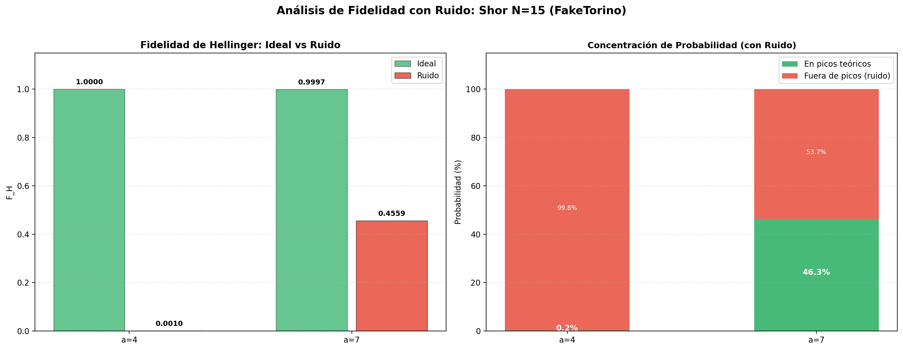

# Análisis de Fidelidad con Ruido: Shor N=15 (FakeTorino)

> **Objetivo:** Cuantificar la degradación de la fidelidad entre distribución teórica y experimental ruidosa.

## 1. Métricas

| Métrica | Fórmula | Interpretación |
|:---|:---|:---|
| Fidelidad Hellinger | F_H = (Σ√(PQ))² | 1=idénticas, 0=disjuntas |

## 2. Gráficas

## 3. Resultados

| Base | r | F_H Ruido | F_H Ideal | ΔF_H | Prob. picos |
|:---:|:---:|:---:|:---:|:---:|:---:|
| 4 | 2 | 0.0010 | 1.0000 | 0.9990 | 0.20% |
| 7 | 4 | 0.4559 | 0.9997 | 0.5438 | 46.29% |

## 4. Interpretación

- La fidelidad con ruido es significativamente menor que la ideal (~1.0).
- a=4 (r=2, opt=3, D2Q=439): F_H≈0.001, casi toda la probabilidad fuera de picos.
- a=7 (r=4, opt=3, D2Q=869): F_H≈0.456, ~46% de probabilidad en picos teóricos.
- Paradójicamente, el circuito más profundo (a=7) tiene MEJOR fidelidad, posiblemente porque tiene más picos (4 vs 2).
