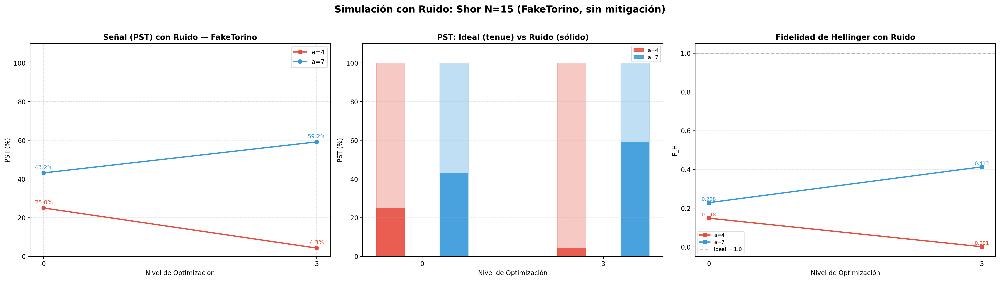

# Resultados de Simulación CON RUIDO: Shor N=15 (FakeTorino)

> **Objetivo:** Cuantificar la degradación cuando se ejecuta con el modelo de ruido real de FakeTorino. Sin mitigación.

## 1. Configuración

- **Backend:** AerSimulator.from_backend(FakeTorino) — ruido activo
- **Bases:** a ∈ [4, 7]
- **Shots:** 512
- **Opt levels:** [0, 3]
- **Mitigación:** Ninguna

## 2. Gráficas

## 3. Métricas

| Base | Opt | D2Q | G2Q | PST (%) | F_H | Factores | T_sim |
|:---:|:---:|:---:|:---:|:---:|:---:|:---:|:---:|
| 4 | 0 | 504 | 749 | 25.0 | 0.1482 | 3, 5 | 203s |
| 4 | 3 | 439 | 600 | 4.3 | 0.0010 | 3, 5 | 168s |
| 7 | 0 | 1015 | 1255 | 43.16 | 0.2285 | 3, 5 | 376s |
| 7 | 3 | 869 | 1071 | 59.18 | 0.4133 | 3, 5 | 6020s |

## 4. Análisis

- PST se degrada significativamente vs ideal (100%): de 4% a 59% dependiendo de la base y optimización.
- F_H con ruido: 0.001–0.413 vs ideal 1.0 — degradación masiva.
- A pesar del ruido extremo, la extracción de factores {3, 5} fue exitosa en todos los casos.
- Se requieren técnicas de mitigación (DD, PT) para mejorar la señal.
