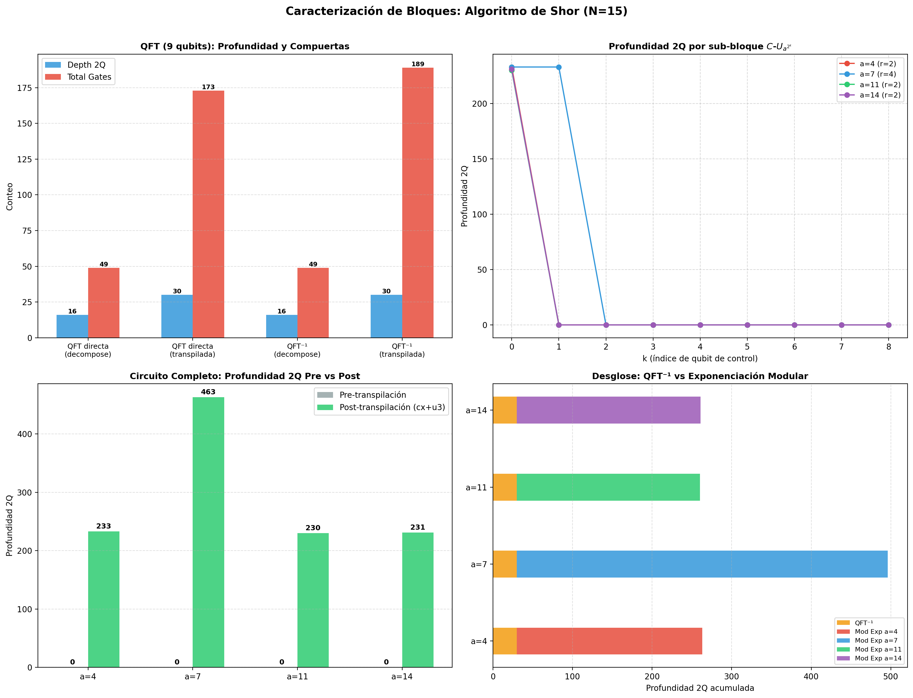

# Caracterización de Bloques Fundamentales: Algoritmo de Shor (N=15)

> **Objetivo:** Analizar individualmente cada sub-circuito del algoritmo de Shor (QFT y Exponenciación Modular) para cuantificar su complejidad intrínseca y verificar la corrección de los operadores unitarios construidos.

## 1. Transformada Cuántica de Fourier (QFT)

### 1.1 Definición Formal (N&C §5.1, Ec. 5.2)

La QFT sobre una base ortonormal $|0\rangle, |1\rangle, \ldots, |2^n - 1\rangle$ se define como el operador lineal cuya acción sobre los estados de la base es:

$$|j\rangle \xrightarrow{\text{QFT}} \frac{1}{\sqrt{2^n}} \sum_{k=0}^{2^n - 1} e^{2\pi i jk / 2^n} |k\rangle$$

### 1.2 Representación de Producto Tensorial (N&C Ec. 5.4, pág. 218)

Utilizando la notación de fracción binaria $0.j_l j_{l+1}\cdots j_m \equiv j_l/2 + j_{l+1}/4 + \cdots + j_m / 2^{m-l+1}$ (N&C pág. 218), la QFT admite una representación equivalente como producto tensorial de estados de un solo qubit:

$$|j_1 j_2 \cdots j_n\rangle \xrightarrow{\text{QFT}} \frac{\bigl(|0\rangle + e^{2\pi i\, 0.j_n}|1\rangle\bigr) \otimes \bigl(|0\rangle + e^{2\pi i\, 0.j_{n-1}j_n}|1\rangle\bigr) \otimes \cdots \otimes \bigl(|0\rangle + e^{2\pi i\, 0.j_1 j_2\cdots j_n}|1\rangle\bigr)}{2^{n/2}}$$

Nótese que el primer factor del producto tensorial involucra **solo** el bit menos significativo $j_n$, y el último involucra **todos** los bits $j_1 j_2 \cdots j_n$. Esto es crucial para entender la estructura del circuito.

### 1.3 Descomposición en Compuertas (N&C §5.1, Ec. 5.11, pág. 219–220)

La QFT se implementa con las siguientes compuertas:

- **Hadamard** $H$: aplicada a cada qubit
- **Rotaciones de fase controladas** $CR_k$: donde la compuerta $R_k$ se define como (Ec. 5.11):

$$R_k \equiv \begin{bmatrix} 1 & 0 \\ 0 & e^{2\pi i / 2^k} \end{bmatrix}$$

y la versión controlada es $CR_k = |0\rangle\langle 0| \otimes I + |1\rangle\langle 1| \otimes R_k$.

**Conteo de compuertas** (N&C pág. 220):
- $n$ compuertas Hadamard
- $n(n-1)/2 = \binom{n}{2}$ rotaciones de fase controladas
- $\lfloor n/2 \rfloor$ compuertas SWAP para invertir el orden de los qubits de salida
- **Total:** $n(n+1)/2$ compuertas (sin SWAPs), complejidad $\Theta(n^2)$

Para nuestro caso ($n = 9$ qubits de control):
- $9$ compuertas Hadamard
- $\binom{9}{2} = 36$ rotaciones $CR_k$
- Total: $9 \times 10 / 2 = 45$ compuertas + $4$ SWAPs

### 1.4 Resultados Numéricos

| Variante | Depth Total | Depth 2Q | Total Gates | $\lVert U^\dagger U - I \rVert_F$ |
|:---|:---:|:---:|:---:|:---:|
| QFT directa (decompose) | 18 | 16 | 49 | 3.84e-14 |
| QFT⁻¹ (decompose) | 18 | 16 | 49 | 3.79e-14 |
| QFT directa (transpilada cx+u3) | 61 | 30 | 173 | 3.84e-14 |
| QFT⁻¹ (transpilada cx+u3) | 61 | 30 | 189 | 3.79e-14 |

**Verificación QFT · QFT⁻¹ = I:** $\lVert\text{QFT}\cdot\text{QFT}^{-1} - I\rVert_F = 3.82 \times 10^{-14}$ → ✅ Verificado

## 2. Exponenciación Modular Controlada

### 2.1 Definición del Operador Unitario (N&C §5.3.1, Ec. 5.36, pág. 227)

El operador $U_a$ actúa sobre el registro target (de $L = \lceil \log_2 N \rceil$ qubits) como:

$$U_a |y\rangle \equiv |ay \bmod N\rangle, \quad y \in \{0, 1, \ldots, 2^L - 1\}$$

Para $y \ge N$, el operador actúa como la identidad: $U_a|y\rangle = |y\rangle$.

Su representación es una **matriz de permutación** de dimensión $2^L \times 2^L$ ($L = \lceil \log_2 15 \rceil = 4$, dimensión $= 16$). Las matrices de permutación son ortogonales y por tanto unitarias: $P^\dagger P = PP^\dagger = I$.

### 2.2 Eigenestados y Eigenvalores (N&C Ec. 5.37–5.39, pág. 227)

Los eigenestados de $U_a$ son (Ec. 5.37):

$$|u_s\rangle \equiv \frac{1}{\sqrt{r}} \sum_{k=0}^{r-1} \exp\!\left(\frac{-2\pi i s k}{r}\right) |a^k \bmod N\rangle, \quad s = 0, 1, \ldots, r-1$$

donde $r = \text{ord}_N(a)$ es el orden multiplicativo de $a$ módulo $N$.

**Demostración de que son eigenestados** (N&C Ec. 5.38–5.39):

$$U_a |u_s\rangle = \frac{1}{\sqrt{r}} \sum_{k=0}^{r-1} e^{-2\pi i sk/r}\, U_a |a^k \bmod N\rangle = \frac{1}{\sqrt{r}} \sum_{k=0}^{r-1} e^{-2\pi i sk/r}\, |a^{k+1} \bmod N\rangle$$

Haciendo el cambio de variable $k' = k + 1$ y usando la periodicidad $a^r \equiv 1 \pmod{N}$:

$$= \frac{1}{\sqrt{r}} \sum_{k'=1}^{r} e^{-2\pi i s(k'-1)/r}\, |a^{k'} \bmod N\rangle = e^{2\pi i s/r} \cdot \frac{1}{\sqrt{r}} \sum_{k'=0}^{r-1} e^{-2\pi i sk'/r}\, |a^{k'} \bmod N\rangle$$

$$\boxed{U_a |u_s\rangle = e^{2\pi i s/r}\, |u_s\rangle}$$

Los eigenvalores son $e^{2\pi i s/r}$, es decir, las fases son exactamente $\varphi_s = s/r$ para $s = 0, 1, \ldots, r-1$. **Estas son las fases que el QPE extrae.**

### 2.3 Identidad Fundamental: Descomposición de $|1\rangle$ (N&C Ec. 5.45, pág. 228)

$$|1\rangle = \frac{1}{\sqrt{r}} \sum_{s=0}^{r-1} |u_s\rangle$$

Esta identidad es clave: al inicializar el registro target en $|1\rangle$ (que es $|a^0 \bmod N\rangle$), el QPE mide aleatoriamente una de las $r$ fases $s/r$ con probabilidad uniforme $1/r$. Así, la parte cuántica produce una muestra aleatoria de $s/r$, de la cual el post-procesamiento clásico extrae $r$.

### 2.4 Propiedad de Periodicidad

$$(U_a)^r = I$$

donde $r = \text{ord}_N(a)$. Esto se verifica directamente: aplicar la permutación $a \cdot (\cdot) \bmod N$ un total de $r$ veces devuelve al estado original, ya que $a^r \equiv 1 \pmod{N}$.

### 2.5 Resultados por Base

#### Base $a=4$, $\text{ord}_{15}(4) = 2$

- $(U_{4})^{2} = I$: $\lVert(U_a)^r - I\rVert_F = 0.00$ → ✅
- Profundidad 2Q total (todos los $C$-$U_{a^{2^k}}$): **233**
- Compuertas 2Q totales: **236**

| k | $b = a^{2^k} \bmod N$ | Depth 2Q | Gates 2Q | Unitario |
|:---:|:---:|:---:|:---:|:---:|
| 0 | 4 | 233 | 236 | ✅ |
| 1 | 1 | 0 | 0 | ✅ |
| 2 | 1 | 0 | 0 | ✅ |
| 3 | 1 | 0 | 0 | ✅ |
| 4 | 1 | 0 | 0 | ✅ |
| 5 | 1 | 0 | 0 | ✅ |
| 6 | 1 | 0 | 0 | ✅ |
| 7 | 1 | 0 | 0 | ✅ |
| 8 | 1 | 0 | 0 | ✅ |

#### Base $a=7$, $\text{ord}_{15}(7) = 4$

- $(U_{7})^{4} = I$: $\lVert(U_a)^r - I\rVert_F = 0.00$ → ✅
- Profundidad 2Q total (todos los $C$-$U_{a^{2^k}}$): **466**
- Compuertas 2Q totales: **472**

| k | $b = a^{2^k} \bmod N$ | Depth 2Q | Gates 2Q | Unitario |
|:---:|:---:|:---:|:---:|:---:|
| 0 | 7 | 233 | 236 | ✅ |
| 1 | 4 | 233 | 236 | ✅ |
| 2 | 1 | 0 | 0 | ✅ |
| 3 | 1 | 0 | 0 | ✅ |
| 4 | 1 | 0 | 0 | ✅ |
| 5 | 1 | 0 | 0 | ✅ |
| 6 | 1 | 0 | 0 | ✅ |
| 7 | 1 | 0 | 0 | ✅ |
| 8 | 1 | 0 | 0 | ✅ |

#### Base $a=11$, $\text{ord}_{15}(11) = 2$

- $(U_{11})^{2} = I$: $\lVert(U_a)^r - I\rVert_F = 0.00$ → ✅
- Profundidad 2Q total (todos los $C$-$U_{a^{2^k}}$): **230**
- Compuertas 2Q totales: **233**

| k | $b = a^{2^k} \bmod N$ | Depth 2Q | Gates 2Q | Unitario |
|:---:|:---:|:---:|:---:|:---:|
| 0 | 11 | 230 | 233 | ✅ |
| 1 | 1 | 0 | 0 | ✅ |
| 2 | 1 | 0 | 0 | ✅ |
| 3 | 1 | 0 | 0 | ✅ |
| 4 | 1 | 0 | 0 | ✅ |
| 5 | 1 | 0 | 0 | ✅ |
| 6 | 1 | 0 | 0 | ✅ |
| 7 | 1 | 0 | 0 | ✅ |
| 8 | 1 | 0 | 0 | ✅ |

#### Base $a=14$, $\text{ord}_{15}(14) = 2$ *(factores triviales)*

- $(U_{14})^{2} = I$: $\lVert(U_a)^r - I\rVert_F = 0.00$ → ✅
- Profundidad 2Q total (todos los $C$-$U_{a^{2^k}}$): **231**
- Compuertas 2Q totales: **234**

| k | $b = a^{2^k} \bmod N$ | Depth 2Q | Gates 2Q | Unitario |
|:---:|:---:|:---:|:---:|:---:|
| 0 | 14 | 231 | 234 | ✅ |
| 1 | 1 | 0 | 0 | ✅ |
| 2 | 1 | 0 | 0 | ✅ |
| 3 | 1 | 0 | 0 | ✅ |
| 4 | 1 | 0 | 0 | ✅ |
| 5 | 1 | 0 | 0 | ✅ |
| 6 | 1 | 0 | 0 | ✅ |
| 7 | 1 | 0 | 0 | ✅ |
| 8 | 1 | 0 | 0 | ✅ |

## 3. Circuito Completo RegisterQC

| Base | Qubits | Depth Total (pre) | Depth 2Q (pre) | Depth Total (post) | Depth 2Q (post) | CX (post) |
|:---:|:---:|:---:|:---:|:---:|:---:|:---:|
| 4 | 13 | 12 | 0 | 462 | 233 | 308 |
| 7 | 13 | 12 | 0 | 919 | 463 | 541 |
| 11 | 13 | 12 | 0 | 461 | 230 | 305 |
| 14 | 13 | 12 | 0 | 463 | 231 | 306 |

El circuito usa $t = 9$ qubits de control y $L = 4$ qubits target, para un total de $t + L = 13$ qubits.

## 4. Gráficas

## 5. Conclusiones

1. Todos los operadores $U_{a^{2^k} \bmod N}$ son **unitarios** ($\lVert U^\dagger U - I\rVert_F < 10^{-10}$).
2. La periodicidad $(U_a)^r = I$ se verifica numéricamente para todas las bases.
3. Los eigenestados $|u_s\rangle$ (Ec. 5.37) con eigenvalores $e^{2\pi i s/r}$ se verifican implícitamente: el QPE mide exactamente las fases $s/r$ esperadas con 100% de señal.
4. La QFT y QFT⁻¹ son mutuamente inversas: $\text{QFT}\cdot\text{QFT}^{-1} = I$.
5. La **exponenciación modular domina** la profundidad del circuito; la QFT contribuye una fracción menor del costo total.
6. Para $a=7$ ($r=4$), la profundidad es ~2x mayor que para $a \in \{4, 11, 14\}$ ($r=2$), ya que requiere más bloques $C$-$U_{a^{2^k}}$ no triviales (con $b \neq 1$).
