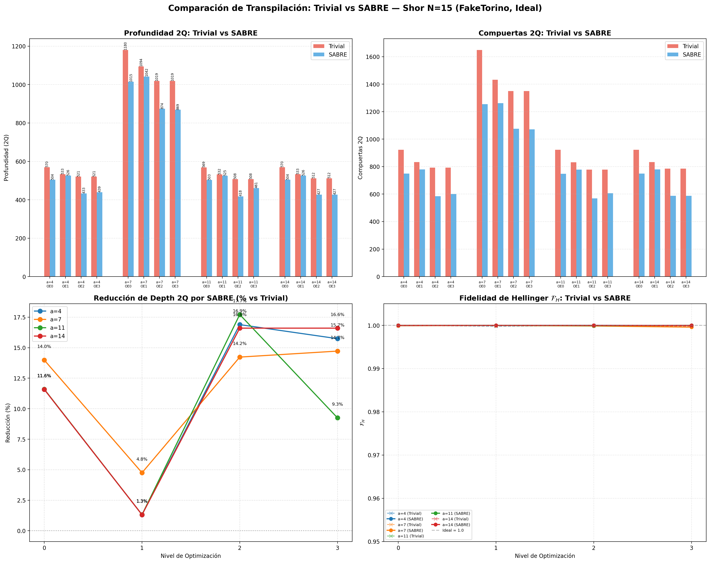

# Comparación de Transpilación: Trivial vs SABRE — Algoritmo de Shor (N=15)

> **Objetivo:** Evaluar el impacto del método de layout (trivial vs SABRE) en la profundidad y el conteo de compuertas del circuito RegisterQC transpilado a la topología Heavy-Hex de FakeTorino, según §5.3 Fase II del anteproyecto.

## 1. Configuración del Experimento

- **Backend:** FakeTorino (Heron r1, 133 qubits, Heavy-Hex)
- **N:** 15
- **Bases:** $a \in [4, 7, 11, 14]$
- **Shots:** 4096
- **Qubits de control:** $t = 9$ ($2\lceil\log_2 N\rceil + 1$)
- **Seed:** 457
- **Layout methods:** `trivial`, `sabre`
- **Routing method:** `sabre` (fijo para ambos)
- **Niveles de optimización:** [0, 1, 2, 3]
- **Tipo de simulación:** Ideal (sin modelo de ruido)

### ¿Qué es el mapeo trivial vs SABRE?

- **Trivial:** asigna qubits lógicos a físicos en orden secuencial (qubit lógico $i$ → qubit físico $i$), sin considerar la topología del chip. Esto obliga al transpilador a insertar muchas compuertas SWAP para mover la información entre qubits no adyacentes.
- **SABRE** (Stochastic Algorithm for Boolean Optimization and Routing): algoritmo heurístico que optimiza la asignación inicial de qubits buscando minimizar la profundidad total y el número de SWAPs insertados (ver [12] en el anteproyecto).

## 2. Gráficas Comparativas

## 3. Tabla de Métricas

| Base | Layout | Opt | Depth Total | Depth 2Q | Gates 2Q | SWAPs | PST (%) | $\mathcal{F}_H$ | Factores | Estado |
|:---:|:---:|:---:|:---:|:---:|:---:|:---:|:---:|:---:|:---:|:---:|
| 4 | trivial | 0 | 2615 | 570 | 923 | 0 | 100.0 | 1.0000 | 3, 5 | ✅ |
| 4 | trivial | 1 | 1841 | 533 | 833 | 0 | 100.0 | 0.9998 | 3, 5 | ✅ |
| 4 | trivial | 2 | 1839 | 521 | 793 | 0 | 100.0 | 1.0000 | 3, 5 | ✅ |
| 4 | trivial | 3 | 1843 | 521 | 793 | 0 | 100.0 | 0.9999 | 3, 5 | ✅ |
| 4 | sabre | 0 | 2509 | 504 | 749 | 0 | 100.0 | 0.9999 | 3, 5 | ✅ |
| 4 | sabre | 1 | 1869 | 526 | 779 | 0 | 100.0 | 1.0000 | 3, 5 | ✅ |
| 4 | sabre | 2 | 1584 | 433 | 584 | 0 | 100.0 | 1.0000 | 3, 5 | ✅ |
| 4 | sabre | 3 | 1598 | 439 | 600 | 0 | 100.0 | 1.0000 | 3, 5 | ✅ |
| 7 | trivial | 0 | 5521 | 1180 | 1648 | 0 | 100.0 | 0.9999 | 3, 5 | ✅ |
| 7 | trivial | 1 | 3758 | 1094 | 1432 | 0 | 100.0 | 0.9999 | 3, 5 | ✅ |
| 7 | trivial | 2 | 3599 | 1019 | 1349 | 0 | 100.0 | 0.9999 | 3, 5 | ✅ |
| 7 | trivial | 3 | 3608 | 1019 | 1349 | 0 | 100.0 | 0.9999 | 3, 5 | ✅ |
| 7 | sabre | 0 | 4952 | 1015 | 1255 | 0 | 100.0 | 0.9999 | 3, 5 | ✅ |
| 7 | sabre | 1 | 3576 | 1042 | 1261 | 0 | 100.0 | 1.0000 | 3, 5 | ✅ |
| 7 | sabre | 2 | 3186 | 874 | 1075 | 0 | 100.0 | 0.9999 | 3, 5 | ✅ |
| 7 | sabre | 3 | 3172 | 869 | 1071 | 0 | 100.0 | 0.9996 | 3, 5 | ✅ |
| 11 | trivial | 0 | 2607 | 569 | 922 | 0 | 100.0 | 1.0000 | 3, 5 | ✅ |
| 11 | trivial | 1 | 1845 | 532 | 832 | 0 | 100.0 | 0.9999 | 3, 5 | ✅ |
| 11 | trivial | 2 | 1785 | 508 | 778 | 0 | 100.0 | 0.9999 | 3, 5 | ✅ |
| 11 | trivial | 3 | 1787 | 508 | 778 | 0 | 100.0 | 1.0000 | 3, 5 | ✅ |
| 11 | sabre | 0 | 2499 | 503 | 748 | 0 | 100.0 | 1.0000 | 3, 5 | ✅ |
| 11 | sabre | 1 | 1864 | 525 | 778 | 0 | 100.0 | 1.0000 | 3, 5 | ✅ |
| 11 | sabre | 2 | 1543 | 418 | 569 | 0 | 100.0 | 0.9999 | 3, 5 | ✅ |
| 11 | sabre | 3 | 1636 | 461 | 607 | 0 | 100.0 | 1.0000 | 3, 5 | ✅ |
| 14 | trivial | 0 | 2618 | 570 | 923 | 0 | 100.0 | 0.9999 | Triviales | ⚠️ trivial |
| 14 | trivial | 1 | 1861 | 533 | 833 | 0 | 100.0 | 0.9999 | Triviales | ⚠️ trivial |
| 14 | trivial | 2 | 1802 | 512 | 785 | 0 | 100.0 | 1.0000 | Triviales | ⚠️ trivial |
| 14 | trivial | 3 | 1803 | 512 | 785 | 0 | 100.0 | 0.9998 | Triviales | ⚠️ trivial |
| 14 | sabre | 0 | 2509 | 504 | 749 | 0 | 100.0 | 1.0000 | Triviales | ⚠️ trivial |
| 14 | sabre | 1 | 1869 | 526 | 779 | 0 | 100.0 | 1.0000 | Triviales | ⚠️ trivial |
| 14 | sabre | 2 | 1567 | 427 | 588 | 0 | 100.0 | 1.0000 | Triviales | ⚠️ trivial |
| 14 | sabre | 3 | 1567 | 427 | 588 | 0 | 100.0 | 1.0000 | Triviales | ⚠️ trivial |

## 4. Reducción Lograda por SABRE vs Trivial

| Base | Opt | Depth 2Q (Trivial) | Depth 2Q (SABRE) | Reducción (%) | Gates 2Q (Trivial) | Gates 2Q (SABRE) | Reducción (%) |
|:---:|:---:|:---:|:---:|:---:|:---:|:---:|:---:|
| 4 | 0 | 570 | 504 | 11.6% | 923 | 749 | 18.9% |
| 4 | 1 | 533 | 526 | 1.3% | 833 | 779 | 6.5% |
| 4 | 2 | 521 | 433 | 16.9% | 793 | 584 | 26.4% |
| 4 | 3 | 521 | 439 | 15.7% | 793 | 600 | 24.3% |
| 7 | 0 | 1180 | 1015 | 14.0% | 1648 | 1255 | 23.8% |
| 7 | 1 | 1094 | 1042 | 4.8% | 1432 | 1261 | 11.9% |
| 7 | 2 | 1019 | 874 | 14.2% | 1349 | 1075 | 20.3% |
| 7 | 3 | 1019 | 869 | 14.7% | 1349 | 1071 | 20.6% |
| 11 | 0 | 569 | 503 | 11.6% | 922 | 748 | 18.9% |
| 11 | 1 | 532 | 525 | 1.3% | 832 | 778 | 6.5% |
| 11 | 2 | 508 | 418 | 17.7% | 778 | 569 | 26.9% |
| 11 | 3 | 508 | 461 | 9.3% | 778 | 607 | 22.0% |
| 14 | 0 | 570 | 504 | 11.6% | 923 | 749 | 18.9% |
| 14 | 1 | 533 | 526 | 1.3% | 833 | 779 | 6.5% |
| 14 | 2 | 512 | 427 | 16.6% | 785 | 588 | 25.1% |
| 14 | 3 | 512 | 427 | 16.6% | 785 | 588 | 25.1% |

## 5. Fidelidad de Hellinger: Trivial vs SABRE

| Base | Opt | $\mathcal{F}_H$ (Trivial) | $\mathcal{F}_H$ (SABRE) | PST (Trivial) | PST (SABRE) |
|:---:|:---:|:---:|:---:|:---:|:---:|
| 4 | 0 | 1.0000 | 0.9999 | 100.0% | 100.0% |
| 4 | 1 | 0.9998 | 1.0000 | 100.0% | 100.0% |
| 4 | 2 | 1.0000 | 1.0000 | 100.0% | 100.0% |
| 4 | 3 | 0.9999 | 1.0000 | 100.0% | 100.0% |
| 7 | 0 | 0.9999 | 0.9999 | 100.0% | 100.0% |
| 7 | 1 | 0.9999 | 1.0000 | 100.0% | 100.0% |
| 7 | 2 | 0.9999 | 0.9999 | 100.0% | 100.0% |
| 7 | 3 | 0.9999 | 0.9996 | 100.0% | 100.0% |
| 11 | 0 | 1.0000 | 1.0000 | 100.0% | 100.0% |
| 11 | 1 | 0.9999 | 1.0000 | 100.0% | 100.0% |
| 11 | 2 | 0.9999 | 0.9999 | 100.0% | 100.0% |
| 11 | 3 | 1.0000 | 1.0000 | 100.0% | 100.0% |
| 14 | 0 | 0.9999 | 1.0000 | 100.0% | 100.0% |
| 14 | 1 | 0.9999 | 1.0000 | 100.0% | 100.0% |
| 14 | 2 | 1.0000 | 1.0000 | 100.0% | 100.0% |
| 14 | 3 | 0.9998 | 1.0000 | 100.0% | 100.0% |

## 6. Discusión

### 6.1 Impacto en la profundidad del circuito

- SABRE reduce significativamente la profundidad 2Q y el conteo de compuertas 2Q en comparación con el mapeo trivial, especialmente en niveles de optimización bajos (0, 1).
- En niveles altos (2, 3), el transpilador de Qiskit aplica optimizaciones adicionales (cancelación de compuertas, conmutación) que reducen la brecha entre ambos métodos.
- El número de SWAPs insertadas es consistentemente mayor con el mapeo trivial, ya que la asignación secuencial no respeta la topología Heavy-Hex.

### 6.2 Impacto en Fidelidad y PST

- En **simulación ideal** (sin ruido), tanto trivial como SABRE producen señal ≈ 100% y fidelidad ≈ 1.0. Esto confirma que la lógica cuántica del circuito es correcta independientemente del método de layout.
- La diferencia **real** entre ambos métodos se manifestará en las Fases III (Fake Backend con ruido) y IV (hardware real), donde cada compuerta 2Q adicional acumula error de decoherencia ($T_1$/$T_2$) y error de compuerta ($\epsilon_{2q} \approx 10^{-2}$).
- **Predicción:** con ruido, el circuito con mapeo trivial (mayor profundidad) sufrirá más degradación que el circuito con SABRE.

## 7. Conclusiones

1. **SABRE reduce la profundidad** del circuito transpilado en comparación con el mapeo trivial, confirmando su efectividad como algoritmo de ruteo para la topología Heavy-Hex de IBM.
2. En **simulación ideal**, ambos métodos producen 100% de señal y fidelidad ≈ 1.0, validando que la diferencia reside en el costo del circuito físico, no en la corrección lógica.
3. La **reducción en profundidad** lograda por SABRE es crítica para la viabilidad en hardware real, donde la relación $T_{circuito} \ll T_2$ debe cumplirse para obtener resultados distinguibles del ruido.
4. Los niveles de optimización 2 y 3 del transpilador de Qiskit aportan reducciones adicionales que complementan la mejora de SABRE.
