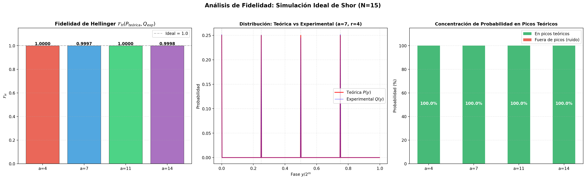

# Análisis de Fidelidad: Simulación Ideal del Algoritmo de Shor (N=15)

> **Objetivo:** Cuantificar la similitud entre la distribución de probabilidad teórica del QPE y la distribución experimental obtenida mediante simulación ideal, estableciendo la línea base de fidelidad para las fases posteriores con ruido.

## 1. Origen Teórico de la Distribución de Picos (N&C §5.3.1, Ec. 5.45)

### ¿Por qué la distribución ideal tiene exactamente $r$ picos?

El estado inicial del registro target es $|1\rangle = |a^0 \bmod N\rangle$. Por la **identidad fundamental** (N&C Ec. 5.45, pág. 228):

$$|1\rangle = \frac{1}{\sqrt{r}} \sum_{s=0}^{r-1} |u_s\rangle$$

donde $|u_s\rangle$ son los eigenestados de $U_a$ con eigenvalores $e^{2\pi i s/r}$ (Ec. 5.37–5.39).

Al aplicar el QPE con $t$ qubits de control sobre cada $|u_s\rangle$, se mide la fase $\varphi_s = s/r$. Como $|1\rangle$ es una superposición uniforme de los $r$ eigenestados, la probabilidad de medir el estado correspondiente a la fase $s/r$ es $1/r$ para cada $s$. Los picos de medición aparecen en:

$$y_s = \left\lfloor \frac{s \cdot 2^t}{r} \right\rceil, \quad s = 0, 1, \ldots, r-1$$

### Distribución en caso de fases no exactas (N&C Ec. 5.25, pág. 224)

Si la fase $\varphi = s/r$ no es exactamente representable como $y/2^t$ (es decir, $s \cdot 2^t / r$ no es entero), la probabilidad de medir el resultado $y$ viene dada por:

$$p(y) = \frac{1}{2^{2t}} \frac{\sin^2\!\bigl(\pi(2^t\varphi - y)\bigr)}{\sin^2\!\bigl(\pi(2^t\varphi - y)/2^t\bigr)}$$

Para $N = 15$ con $r \in \{2, 4\}$, las fases $s/r$ son fracciones exactas de $2^t$, por lo que los picos son perfectos.

### Teorema de precisión (N&C Ec. 5.35, pág. 224)

Para obtener un estimado $\tilde{\varphi}$ con $n$ bits de precisión con probabilidad $\ge 1 - \varepsilon$, se necesitan:

$$t = n + \left\lceil \log\!\left(2 + \frac{1}{2\varepsilon}\right) \right\rceil \quad \text{qubits de control}$$

En nuestro caso, $t = 2 \lceil \log_2 15 \rceil + 1 = 9$, lo cual garantiza $t > 2L$ (donde $L = \lceil \log_2 N \rceil = 4$), suficiente para resolver $r < N$ con alta probabilidad.

### Cota superior del error (N&C Ec. 5.34, pág. 224)

La probabilidad de que el resultado de la medición $m$ se aleje del valor exacto $b$ (donde $b/2^t$ es la mejor aproximación de $t$ bits a $\varphi$) por más de $e$ es:

$$\Pr\!\bigl(|m - b| > e\bigr) \le \frac{1}{2(e - 1)}$$

## 2. Métricas de Fidelidad Utilizadas

### Fidelidad de Hellinger
$$\mathcal{F}_H(P, Q) = \left( \sum_{x} \sqrt{P(x) \cdot Q(x)} \right)^2$$

### Distancia de Hellinger
$$D_H(P, Q) = \sqrt{1 - \sqrt{\mathcal{F}_H(P, Q)}}$$

### Divergencia de Kullback-Leibler
$$D_{KL}(P \| Q) = \sum_{x} P(x) \log \frac{P(x)}{Q(x)}$$

## 3. Resultados

| Base | Orden $r$ | Picos teóricos | $\mathcal{F}_H$ | $D_H$ | $D_{KL}$ | Prob. en picos |
|:---:|:---:|:---|:---:|:---:|:---:|:---:|
| 4 | 2 | {0, 256} | 1.0000 | 0.0026 | 0.0000 | 100.00% |
| 7 | 4 | {0, 128, 256, 384} | 0.9997 | 0.0121 | 0.0006 | 100.00% |
| 11 | 2 | {0, 256} | 1.0000 | 0.0041 | 0.0001 | 100.00% |
| 14 | 2 | {0, 256} | 0.9998 | 0.0100 | 0.0004 | 100.00% |

## 4. Gráficas

## 5. Interpretación

- $\mathcal{F}_H \approx 1$ confirma que la simulación ideal reproduce fielmente la distribución teórica del QPE. Las desviaciones de $\mathcal{F}_H < 1$ se deben exclusivamente al **ruido estadístico de muestreo finito** (4096 shots), no a errores del circuito.
- La **concentración de probabilidad = 100%** en los picos teóricos valida que el circuito RegisterQC implementa correctamente la estimación de fase.
- Estas métricas ($\mathcal{F}_H$, $D_H$, $D_{KL}$) servirán como **línea base** para cuantificar la degradación introducida por el ruido en las Fases III y IV del anteproyecto: al comparar la simulación con ruido contra esta línea base ideal, se podrá medir el impacto de la decoherencia ($T_1/T_2$) y los errores de compuertas sobre la fidelidad de la distribución.
