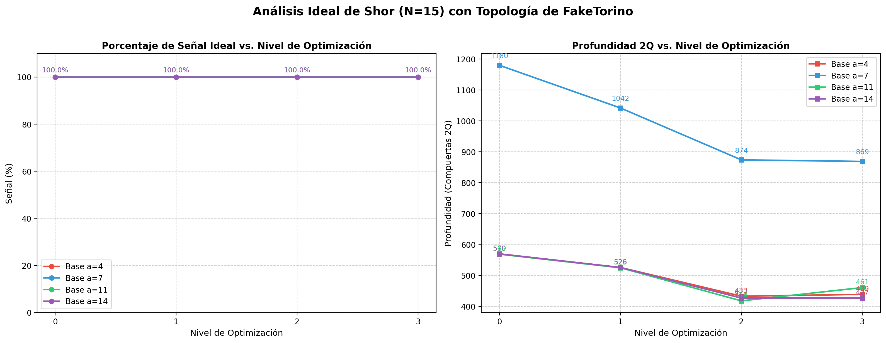

# Resultados de Simulación Ideal: Algoritmo de Shor (N=15) en FakeTorino

> **Objetivo:** Evaluar el impacto de la transpilación (topología de FakeTorino) y los niveles de optimización en la profundidad del circuito y la probabilidad de éxito de señales puras (sin ruido térmico), según la Fase III del anteproyecto.

## 1. Gráficas Comparativas

## 2. Tabla de Métricas por Base (a)

| Base | Nivel Opt. | Depth 2Q | Compuertas 2Q | Señal (%) | Ruido (%) | Factores Extraídos | Éxito |
|:---:|:---:|:---:|:---:|:---:|:---:|:---:|:---:|
| 4 | 0 | 570 | 923 | 100.0 | 0.0 | 3, 5 | ✅ |
| 4 | 1 | 526 | 779 | 100.0 | 0.0 | 3, 5 | ✅ |
| 4 | 2 | 433 | 584 | 100.0 | 0.0 | 3, 5 | ✅ |
| 4 | 3 | 439 | 600 | 100.0 | 0.0 | 3, 5 | ✅ |
| 7 | 0 | 1180 | 1648 | 100.0 | 0.0 | 3, 5 | ✅ |
| 7 | 1 | 1042 | 1261 | 100.0 | 0.0 | 3, 5 | ✅ |
| 7 | 2 | 874 | 1075 | 100.0 | 0.0 | 3, 5 | ✅ |
| 7 | 3 | 869 | 1071 | 100.0 | 0.0 | 3, 5 | ✅ |
| 11 | 0 | 569 | 922 | 100.0 | 0.0 | 3, 5 | ✅ |
| 11 | 1 | 525 | 778 | 100.0 | 0.0 | 3, 5 | ✅ |
| 11 | 2 | 418 | 569 | 100.0 | 0.0 | 3, 5 | ✅ |
| 11 | 3 | 461 | 607 | 100.0 | 0.0 | 3, 5 | ✅ |
| 14 | 0 | 570 | 923 | 100.0 | 0.0 | Triviales {1, N} | ⚠️ trivial |
| 14 | 1 | 526 | 779 | 100.0 | 0.0 | Triviales {1, N} | ⚠️ trivial |
| 14 | 2 | 427 | 588 | 100.0 | 0.0 | Triviales {1, N} | ⚠️ trivial |
| 14 | 3 | 427 | 588 | 100.0 | 0.0 | Triviales {1, N} | ⚠️ trivial |

## 3. Discusión Técnica
- Al tratarse de una **simulación ideal** (sin modelo de decoherencia $T_1/T_2$ o error en compuertas), la fidelidad y la señal (%) deberían mantenerse cercanas al 100% independientemente de la profundidad. Cualquier pérdida se debe a la dispersión intrínseca del QPE.
- La simulación sobre la topología de *FakeTorino* sí nos permite contrastar cuántos SWAPs y compuertas `ECR` son introducidas lógicamente por el ruteo hacia la topología Heavy-Hex en comparación a una topología "todos-con-todos" subyacente de un simulador genérico.
- Las bases evaluadas fueron las calculadas teóricamente como óptimas: $a \in [4, 7, 11, 14]$.

## 4. Nota sobre $a=14$ y factores triviales
- Para $a=14 \equiv -1 \pmod{15}$, el orden encontrado es $r=2$, lo cual es correcto.
- Sin embargo, $\gcd(14^{2/2} - 1, 15) = \gcd(13, 15) = 1$ y $\gcd(14^{2/2} + 1, 15) = \gcd(15, 15) = 15$.
- Ambos resultados son **factores triviales** $\{1, N\}$. Esto es una propiedad algebraica intrínseca: cuando $a \equiv -1 \pmod{N}$, el algoritmo de Shor siempre produce factores triviales (ver Nielsen \& Chuang §5.3.2).
- La parte cuántica del algoritmo funciona correctamente — el QPE mide las fases $0.0$ y $0.5$ con señal 100%.
