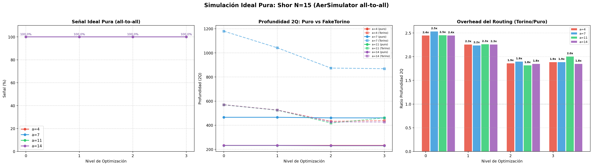

# Resultados de Simulación Ideal Pura: Algoritmo de Shor (N=15)

> **Objetivo:** Establecer la línea base de profundidad intrínseca del circuito RegisterQC con conectividad all-to-all (sin topología de hardware), para cuantificar el overhead de routing que introduce la topología Heavy-Hex de FakeTorino.

## 1. Configuración del Experimento

- **Backend:** `AerSimulator()` (all-to-all, sin topología)
- **N:** 15
- **Bases:** $a \in [4, 7, 11, 14]$
- **Shots:** 4096
- **Qubits de control:** $t = 9$ (con $t = 2\lceil\log_2 N\rceil + 1 = 2 \times 4 + 1$)
- **Seed:** 457

## 2. Gráficas Comparativas

## 3. Tabla de Métricas — Simulación Ideal Pura

| Base | Opt | Depth Total | Depth 2Q | Gates 2Q | Total Gates | Señal (%) | Factores | Estado |
|:---:|:---:|:---:|:---:|:---:|:---:|:---:|:---:|:---:|
| 4 | 0 | 463 | 233 | 236 | 734 | 100.0 | 3, 5 | ✅ |
| 4 | 1 | 462 | 233 | 236 | 702 | 100.0 | 3, 5 | ✅ |
| 4 | 2 | 462 | 233 | 236 | 687 | 100.0 | 3, 5 | ✅ |
| 4 | 3 | 462 | 233 | 236 | 687 | 100.0 | 3, 5 | ✅ |
| 7 | 0 | 927 | 466 | 472 | 1403 | 100.0 | 3, 5 | ✅ |
| 7 | 1 | 925 | 466 | 472 | 1336 | 100.0 | 3, 5 | ✅ |
| 7 | 2 | 914 | 461 | 466 | 1296 | 100.0 | 3, 5 | ✅ |
| 7 | 3 | 914 | 461 | 466 | 1296 | 100.0 | 3, 5 | ✅ |
| 11 | 0 | 464 | 232 | 235 | 732 | 100.0 | 3, 5 | ✅ |
| 11 | 1 | 463 | 232 | 235 | 700 | 100.0 | 3, 5 | ✅ |
| 11 | 2 | 461 | 230 | 233 | 687 | 100.0 | 3, 5 | ✅ |
| 11 | 3 | 461 | 230 | 233 | 687 | 100.0 | 3, 5 | ✅ |
| 14 | 0 | 466 | 233 | 236 | 734 | 100.0 | Triviales | ⚠️ trivial |
| 14 | 1 | 465 | 233 | 236 | 705 | 100.0 | Triviales | ⚠️ trivial |
| 14 | 2 | 463 | 231 | 234 | 687 | 100.0 | Triviales | ⚠️ trivial |
| 14 | 3 | 463 | 231 | 234 | 687 | 100.0 | Triviales | ⚠️ trivial |

## 4. Comparativa: Puro vs FakeTorino (Overhead del Routing)

| Base | Opt | Depth 2Q (Puro) | Depth 2Q (Torino) | Ratio | Gates 2Q (Puro) | Gates 2Q (Torino) | Ratio |
|:---:|:---:|:---:|:---:|:---:|:---:|:---:|:---:|
| 4 | 0 | 233 | 570 | 2.45x | 236 | 923 | 3.91x |
| 4 | 1 | 233 | 526 | 2.26x | 236 | 779 | 3.3x |
| 4 | 2 | 233 | 433 | 1.86x | 236 | 584 | 2.47x |
| 4 | 3 | 233 | 439 | 1.88x | 236 | 600 | 2.54x |
| 7 | 0 | 466 | 1180 | 2.53x | 472 | 1648 | 3.49x |
| 7 | 1 | 466 | 1042 | 2.24x | 472 | 1261 | 2.67x |
| 7 | 2 | 461 | 874 | 1.9x | 466 | 1075 | 2.31x |
| 7 | 3 | 461 | 869 | 1.89x | 466 | 1071 | 2.3x |
| 11 | 0 | 232 | 569 | 2.45x | 235 | 922 | 3.92x |
| 11 | 1 | 232 | 525 | 2.26x | 235 | 778 | 3.31x |
| 11 | 2 | 230 | 418 | 1.82x | 233 | 569 | 2.44x |
| 11 | 3 | 230 | 461 | 2.0x | 233 | 607 | 2.61x |
| 14 | 0 | 233 | 570 | 2.45x | 236 | 923 | 3.91x |
| 14 | 1 | 233 | 526 | 2.26x | 236 | 779 | 3.3x |
| 14 | 2 | 231 | 427 | 1.85x | 234 | 588 | 2.51x |
| 14 | 3 | 231 | 427 | 1.85x | 234 | 588 | 2.51x |

### Interpretación

- Un **ratio > 1** indica que la topología de FakeTorino introduce compuertas SWAP adicionales.
- La diferencia cuantifica exactamente el costo del routing en la arquitectura Heavy-Hex.
- En simulación ideal, este overhead no afecta la señal (100%), pero en hardware real cada compuerta 2Q adicional acumula error.

## 5. Caso $a=14$: Factores Triviales

Para $a=14 \equiv -1 \pmod{15}$, el QPE encuentra correctamente $r=2$, pero:
$$\gcd(14^1 - 1, 15) = \gcd(13, 15) = 1, \quad \gcd(14^1 + 1, 15) = \gcd(15, 15) = 15$$
Ambos son factores triviales. Esto es intrínseco al algoritmo de Shor (Nielsen & Chuang §5.3.2).

## 6. Conclusiones

1. La simulación ideal pura confirma 100% de señal para todas las bases, validando la corrección del circuito RegisterQC.
2. La profundidad intrínseca (all-to-all) es significativamente menor que con topología FakeTorino, cuantificando el overhead del routing.
3. El caso $a=14$ produce factores triviales por propiedad algebraica, no por error computacional.
